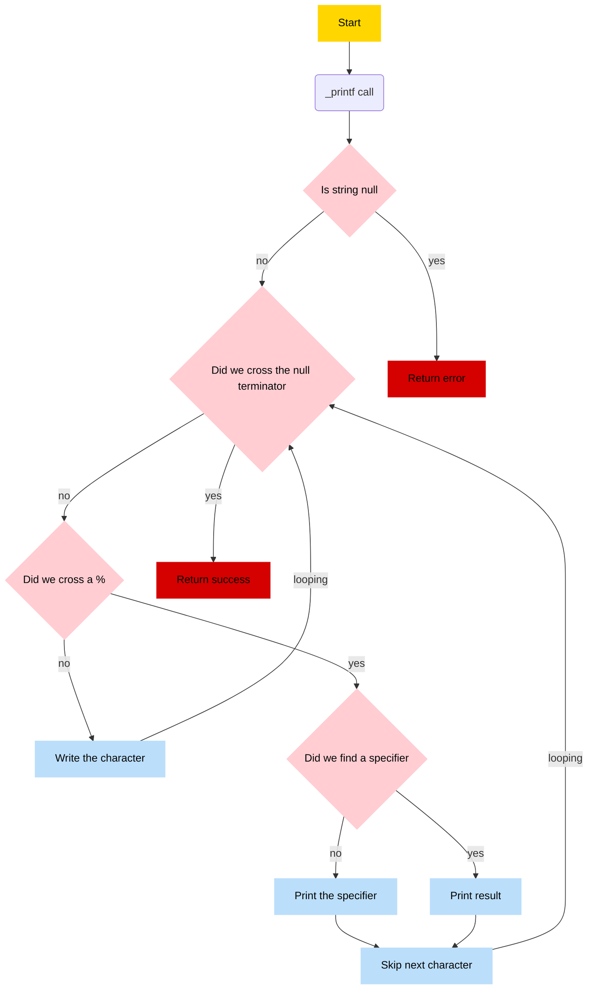

```plaintext
             _       _    __    __            _                   
  _ __  _ __(_)_ __ | |_ / _|  / _| __ _  ___| |_ ___  _ __ _   _ 
 | '_ \| '__| | '_ \| __| |_  | |_ / _` |/ __| __/ _ \| '__| | | |
 | |_) | |  | | | | | |_|  _| |  _| (_| | (__| || (_) | |  | |_| |
 | .__/|_|  |_|_| |_|\__|_|   |_|  \__,_|\___|\__\___/|_|   \__, |
 |_|                                                        |___/
                     Powered by your mad C skills ⚡

```


# 🏭 `printf_factory` — Modular and Extensible printf Implementation
## 📝 Overview

`_printf` is a custom implementation of the standard C `printf` function. It replicates much of its core functionality while supporting modular, scalable, and maintainable extensions.

This project includes:

- **Mandatory format specifiers:**
  - `%c`, `%s`, `%d`, `%i`

- **Advanced format specifiers:**
  - `%b` – Binary representation
  - `%o` – Octal
  - `%x`, `%X` – Hexadecimal (lower/upper case)
  - `%u` – Unsigned decimal
  - `%p` – Pointer address

- **Custom extensions:**
  - `%S` – Prints strings, escaping non-printable characters in hex
  - `%r` – Prints strings in reverse
  - `%R` – Applies ROT13 encryption to strings

- **Feature support:**
  - Flags: `+`, space, `0`, `-`, `#`
  - Field width and precision
  - Length modifiers: `l`, `h`, `hh`

The architecture is based on a **specifier-dependent pipeline**: each format specifier has its own handler function, managed through a dynamic dispatch table (factory model). This allows new specifiers to be added easily with minimal changes to the core.

_This modular design ensures better maintainability_
width, and precision, all managed through a centralized factory system.

## 🧠 Architecture & Flow

This project is organized around a modular architecture, where the behavior of `_printf` is **format-specifier dependent**. Each specifier can define its own processing pipeline.

### 🧵 General Pipeline

1. **Entry Point — `_printf()`**
   - Parses the format string character-by-character.
   - For each `%specifier`, it builds a `format_specifier_t` struct with parsed metadata.
   - Delegates formatting logic to `format_handler()`.

2. **Specifier Dispatch — `format_handler()`**
   - Retrieves the correct handler function from the `factory` using the specifier.
   - Calls the handler, passing the specifier struct and variadic arguments.

3. **Specifier Handler — e.g. `string_handler()`, `binary_handler()`**
   - Produces a dynamically allocated string with the formatted result.
   - May use helper utilities such as `_strdup`, `_strlen`, etc.

4. **Output — `_putchar()`**
   - Prints the final string to STDOUT and returns the number of printed characters.
   - All memory used for formatting is freed properly.

### 🧬 Specifier-Dependent Behavior

Each format specifier (`%d`, `%s`, `%b`, `%r`, etc.) can define a **custom pipeline**.
For example, the `%r` (reverse string) handler will:
- Allocate memory.
- Reverse the input string manually.
- Return a new string to print.

This design allows new specifiers to be added with minimal coupling, just by registering them in `get_handler_function` and defining a handler function.

## 🧼 Memory Management

`_printf` dynamically allocates memory during formatting operations such as number-to-string conversions and string manipulations. To prevent memory leaks and undefined behavior:

- **All dynamically allocated memory is properly freed** after use.
- Format handler functions return `malloc`-ed strings that are printed and then released.
- Helper utilities (e.g., `_strdup`, `_strlen`) are used with clear ownership.

### ✅ Valgrind Checks

The project is regularly tested with [Valgrind](https://valgrind.org/) to ensure memory is handled safely.

Example output:

```
==18645== HEAP SUMMARY:
==18645==     in use at exit: 0 bytes in 0 blocks
==18645==   total heap usage: 64 allocs, 64 frees, 1,398 bytes allocated
==18645==
==18645== All heap blocks were freed -- no leaks are possible
==18645==
==18645== For lists of detected and suppressed errors, rerun with: -s
==18645== ERROR SUMMARY: 0 errors from 0 contexts (suppressed: 0 from 0)
```

This confirms that `_printf` is leak-free and memory-safe.
## 🧩 Modularity

printf_factory is designed with modularity at its core, making it easy to extend and maintain. Each format specifier has its own dedicated handler function, which is registered in a central factory system. This approach provides several benefits:

- **Separation of Concerns:** Each handler is responsible for formatting a specific specifier, keeping logic isolated and focused.
- **Ease of Extension:** Adding a new format specifier is as simple as implementing a new handler and registering it in the factory.
- **Maintainability:** Changes to one specifier’s behavior do not affect others, reducing the risk of bugs.
- **Reusable Components:** Common utilities (like string duplication, length calculation, or padding) are shared across handlers to avoid code duplication.

This modular architecture enables a flexible printf implementation that can evolve without major rewrites.

## 🔖 Table of Contents

<details>
<summary>CLICK TO ENLARGE 😇</summary>

- 📄 [Description](#description)
- 🎓 [Objectives](#objectives)
- 📋 [Flow Chart](#flowchart)
- 📥 [Installation](#instalation)
- 🏗️ [Compilation](#compilation)
- 📄 [Restrictions](#restrictions)
- ⚒️ [Feature](#feature)
- ➕ [Adding a New Specifier](#-adding-a-new-specifier)
- 🔨 [Tech Stack](#tech-stack)
- 📂 [Files Description](#files-description)
- 👷🏼‍♂️👷🏼‍♂️ [Authors](#authors)

</details>


## 📄 <span id="description">Description</span>

printf_factory is a modular version of the standard C printf.
It focuses on printing formatted strings, with an architecture that makes adding new specifiers and features easy.

## 🎓 <span id="objectives">Objectives</span>

- **Mandatory Features:**
  - Support for basic format specifiers:
    - `%c` – character
    - `%s` – string
    - `%d` – signed decimal integer
    - `%i` – signed integer (identical to `%d`)

- **Advanced Features:**
  - Support for additional specifiers:
    - `%b` – binary
    - `%o` – octal
    - `%x` – hexadecimal (lowercase)
	- `%X` - hexadecimal (uppercase)
    - `%p` – pointer address
    - Custom extensions (`%r`, `%S`, `%R`, etc.)

## 📋 <span id="flowchart">Flow chart</span>


##  🏗️ <span id="instalation">Instalation</span>
To install, you need to clone the repository as follows:
```
git clone https://github.com/AdelMej/holbertonschool-printf
cd holbertonschool-printf
```

To use the manual :

```
sudo apt install groff /* To install Groff */
groff -Tascii -man man_3_printf /* To use manual with groff */
```

On linux :
```
man ./man_3_printf
```

## ⚙️ <span id="compilation">Compilation</span>

You can compile the project using the provided `Makefile`.

### 🔧 Building

#### Run:
```bash
make
```

- This will:

	- Compile all .c source files into .o object files.

	- Generate the binary (default: _printf) — you can change the binary name in the Makefile.

	- Note: You must provide your own main.c file, or the binary will not be created.

### 🧹 Cleaning
#### To remove all compiled files, run:

```bash
make clean
```

 - This will delete the binary and all .o object files to ensure a fresh build.
## 📄 <span id="restrictions">Restrictions</span>

- The restrictions are as follows:
	- `Must follow betty standard`

	- `No more than 5 functions per file`

	- `No use of global variables`

 - Authorized functions and macros:

	- `write`
	- `malloc`
	- `free`
	- `va_start`
	- `va_end`
	- `va_copy`
	- `va_arg`


## ⚒️ <span id="feature">Features</span>

### 🔹 Basic Usage

You can use `_printf()` as a drop-in replacement for the standard `printf()` function in your C programs.

```c
#include "main.h"

int main(void)
{
    _printf("%c\n", 'A');                      // Print a character
    _printf("%s\n", "My name is Toto");       // Print a string
    _printf("%d\n", 12345);                   // Print a decimal number
    _printf("%i\n", -1);                      // Print an integer (same as %d)
    return (0);
}
```

### 🔹 Variadic Function
_printf is a variadic function, meaning it accepts a variable number of arguments.

✅ Function Prototype

```c
int _printf(const char *format, ...);
```

### 🔹 Format Specifiers
You can print various types by using format specifiers, which begin with a % character followed by a specific letter.

#### Example: Using a Format Specifier with a Variable

```c
#include "main.h"

int main(void)
{
    int age = 18;
    _printf("Toto is %d years old.\n", age);
    return (0);
}
```
Expected output:
```bash
$: Toto is 18 years old.
```

### Implementation Notes
- Initially planned to implement a hash map for format specifier handlers for faster lookups.

- Due to project constraints disallowing sizeof, implementing a reliable hash map proved unfeasible.

- Opted for a clean and maintainable array-based factory pattern instead, ensuring robust and clear code.
## ➕ Adding a New Specifier

To extend `_printf` with a new format specifier, follow these steps:

1. **Create the handler function**  
   Implement a function that accepts the format specifier data and variadic arguments, processes them, and returns a dynamically allocated formatted string.

2. **Register the handler in the factory**  
   Add an entry in the specifier-to-handler mapping (in `get_handler_function`) linking your new specifier character to your handler function.

3. **Update parsing logic (if necessary)**  
   If your specifier requires additional metadata (flags, width, precision), update the format specifier parsing to capture this.

4. **Add tests**
   Write unit tests that cover your new specifier, including edge cases.

### Example: Adding `%r` for reversed strings

- Implement `reverse_handler()` that reverses the input string and returns the result.
- Register `'r'` → `reverse_handler` in the factory map.
- Test with:
  ```c
  _printf("Reversed: %r", "hello");
Expected output:
```bash
$: Reversed: olleh
```

This modular approach allows _printf to be easily extended without modifying core logic.

## 🔨 <span id="tech-stack">Tech stack</span>

<p align="left">


</p>

## 📂 <span id="files-description">File description</span>

| **FILE**            | **DESCRIPTION**                                  |
| :----------------- | ------------------------------------------------- |
| [`README.md`](https://github.com/JeremyLrs/holbertonschool-printf/blob/main/README.md)| The `README.md` file.|
| [`binary_handler.c`](https://github.com/AdelMej/holbertonschool-printf/blob/main/binary_handler.c)| Convert unsigned int in binary depending on length (long,short,unsigned char) |
| [`binary_handler_length.c`](https://github.com/AdelMej/holbertonschool-printf/blob/main/binary_handler_length.c)| Provide functions for dealing with length for binary handler|
| [`convert_base.c`](https://github.com/AdelMej/holbertonschool-printf/blob/main/convert_base.c)| convert unsigned int to a string depending on base (binary, octale, haxadecimal).|
| [`custom_handler_string.c`](https://github.com/AdelMej/holbertonschool-printf/blob/main/custom_handler_string.c)| Create string given in argument into a string where special characters are converted in hexadecimal|
| [`standard_pipeline.c`](https://github.com/AdelMej/holbertonschool-printf/blob/main/standard_pipeline.c)| Functions to apply width, flags and precision|
| [`flag_handler.c`](https://github.com/AdelMej/holbertonschool-printf/blob/main/flag_handler.c)| Functions to deal with flags |
| [`flag_helper.c`](https://github.com/AdelMej/holbertonschool-printf/blob/main/flag_helper.c)| Provides helper functions for flag_handler|
| [`get_handler_function.c`](https://github.com/AdelMej/holbertonschool-printf/blob/main/get_handler_function.c)| Function that returns a pointer to a function handler.|
| [`hexa_lowercase_handler.c`](https://github.com/AdelMej/holbertonschool-printf/blob/main/hexa_lowercase_handler.c)| Convert unsigned int in lowercase hexadecimal depending on length (long,short,unsigned char)|
| [`hexa_lowercase_handler_length.c`](https://github.com/AdelMej/holbertonschool-printf/blob/main/hexa_lowercase_handler_length.c)|Provides helper functions for dealing with length to hexa_lowercase_handler|
| [`hexa_uppercase_handler.c`](https://github.com/AdelMej/holbertonschool-printf/blob/main/hexa_uppercase_handler.c)| Convert unsigned int in uppercase hexadecimal depending on length (long,short,unsigned char)|
| [`hexa_uppercase_handler_length.c`](https://github.com/AdelMej/holbertonschool-printf/blob/main/hexa_uppercase_handler_length.c)| Provides helper functions for dealing with length to hexa_uppercase_handler|
| [`int_handler.c`](https://github.com/AdelMej/holbertonschool-printf/blob/main/int_handler.c)| Convert a char or int into a string |
| [`int_handler_length.c`](https://github.com/AdelMej/holbertonschool-printf/blob/main/int_handler_length.c)| Provides helper functions for dealing with length to int_handler |
| [`int_helper.c`](https://github.com/AdelMej/holbertonschool-printf/blob/main/int_helper.c)| Function to provide the size for malloc |
| [`length_handler.c`](https://github.com/AdelMej/holbertonschool-printf/blob/main/length_handler.c)| Function to deal with length |
| [`main.h`](https://github.com/AdelMej/holbertonschool-printf/blob/main/main.h)|Header file containting structures, handler functions and their helpers|
| [`octal_handler.c`](https://github.com/AdelMej/holbertonschool-printf/blob/main/octal_handler.c)| Convert unsigned int in octale depending on length (long,short,unsigned char)|
| [`octal_handler_length.c`](https://github.com/AdelMej/holbertonschool-printf/blob/main/octal_handler_length.c)|Provides helper functions for dealing with length to octal handler |
| [`pointer_handler.c`](https://github.com/AdelMej/holbertonschool-printf/blob/main/pointer_handler.c)| handles pointer conversion in hexadecimal |
| [`precision_handler.c`](https://github.com/AdelMej/holbertonschool-printf/blob/main/precision_handler.c)|Function to deal with precision |
| [`printf_factory.c`](https://github.com/AdelMej/holbertonschool-printf/blob/main/printf_factory.c)| Function that mimics printf behavior |
| [`putchar_helper.c`](https://github.com/AdelMej/holbertonschool-printf/blob/main/putchar_helper.c)| Functions that provide buffering and printing for _printf |
| [`reversed_string_handler.c`](https://github.com/AdelMej/holbertonschool-printf/blob/main/reversed_string_handler.c)| Functions that returns a reversed string |
| [`rot13_handler.c`](https://github.com/AdelMej/holbertonschool-printf/blob/main/rot13_handler.c)| Converts a string in rot13 |
| [`string_handler.c`](https://github.com/AdelMej/holbertonschool-printf/blob/main/string_handler.c)| Provides a newly allocated copy of a string |
| [`string_helper.c`](https://github.com/AdelMej/holbertonschool-printf/blob/main/string_helper.c)| Provides utility functions for string operations |
| [`unsigned_int_handler.c`](https://github.com/AdelMej/holbertonschool-printf/blob/main/unsigned_int_handler.c)| Converts an unsigned int into string |
| [`unsigned_int_handler_length.c`](https://github.com/AdelMej/holbertonschool-printf/blob/main/unsigned_int_handler_length.c)| Provide functions for dealing with length to unsigned int handler |
| [`unsigned_int_helper.c`](https://github.com/AdelMej/holbertonschool-printf/blob/main/unsigned_int_helper.c)| Function to provide the size for malloc to unsigned int |
| [`width_handler.c`](https://github.com/AdelMej/holbertonschool-printf/blob/main/width_handler.c)| Function to deal with width |
| [`man_3_printf`](https://github.com/AdelMej/holbertonschool-printf/blob/main/man_3_printf)| Manual page for `printf`.|

## 👷🏼‍♂️👷🏼‍♂️ <span id="authors">Authors</span>

**👷🏼‍♂️ Adel MEJRISSI**
- GitHub: [@AdelMej](https://github.com/AdelMej)
- LinkedIn: [@adel-mejrissi](https://www.linkedin.com/in/adel-mejrissi-709374172/)

**👷🏼‍♂️ Jérémy LAURENS**
- GitHub: [@JeremyLrs](https://github.com/JeremyLrs)
- LinkedIn: [@jeremylrs](www.linkedin.com/in/jeremylrs)
