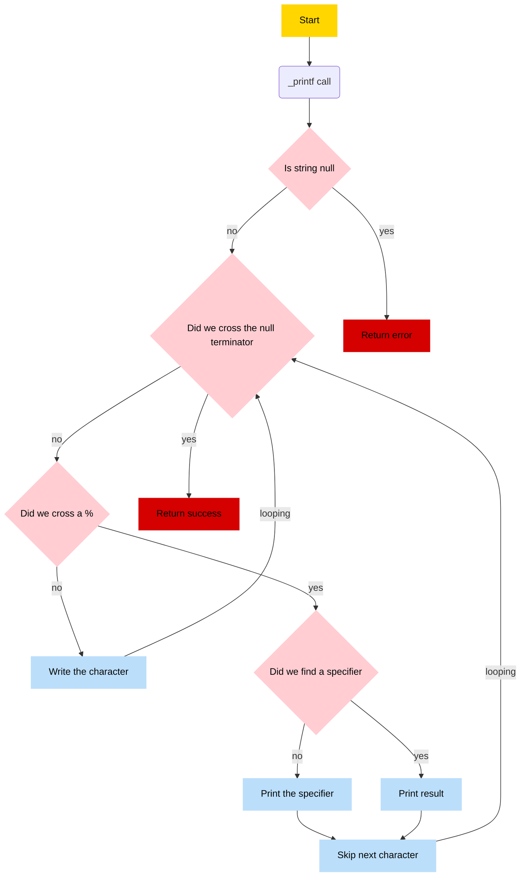

# `printf_factory` — Modular and Extensible printf Implementation
## Overview
printf_factory is a custom implementation of the C printf function, designed with modularity and extensibility in mind. It supports a wide range of standard and custom format specifiers, comprehensive handling of length modifiers, flags, width, and precision, all managed through a centralized factory system.

## Architecture & Flow
printf_factory is designed with modularity and extensibility in mind. Here’s how it works step-by-step:

### Parsing
The input format string is scanned to identify format specifiers along with any flags, width, precision, and length modifiers.

### Handler Dispatch
For each specifier, the factory queries the format_handler function, which calls get_function_handler to retrieve the corresponding handler function.

### Specifier Handling
The handler function receives the va_list argument and formatting information. It processes the input according to the specifier type and length modifiers (like l, h, hh), then returns a newly allocated string representing the formatted data.

### Standard Pipeline Processing
The generated string is passed through a standard pipeline that applies formatting such as width, flags, and precision to produce the final output string.
Note: The pipeline is specifier-dependent, meaning it adapts its processing steps based on the type of specifier to ensure correct formatting behavior.

### Output and Cleanup
The fully formatted string is then printed or stored as needed. Memory allocated by handlers is freed appropriately to avoid leaks.

## Memory Management
_printf dynamically allocates memory for strings generated by handlers based on the format specifiers and their length modifiers. Each handler is responsible for:
Allocating sufficient memory to hold the formatted string.
Returning a pointer to the allocated string.
The standard pipeline then processes the formatted string to apply width, flags, and precision, potentially creating a new string buffer to reflect these modifications.

Important notes:

All dynamically allocated strings are freed after printing to avoid memory leaks.
Handlers must ensure to return NULL if allocation fails.
If the input string pointer for a %s-style specifier is NULL, it is safely replaced with the string "(null)" to avoid undefined behavior.
Undefined or missing arguments for specifiers (e.g., calling %r without an argument) can cause undefined behavior and should be avoided.
To verify memory safety, valgrind has been used extensively during development, showing no leaks or invalid reads/writes after fixes.

```
==12345== HEAP SUMMARY:
==12345==     in use at exit: 0 bytes in 0 blocks
==12345==   total heap usage: 64 allocs, 64 frees, 1,398 bytes allocated
==12345==
==12345== All heap blocks were freed -- no leaks are possible
==12345==
==12345== ERROR SUMMARY: 0 errors from 0 contexts (suppressed: 0 from 0)
```
```
## 🔖 Table of contents

<details>
  <summary>
    CLICK TO ENLARGE 😇
  </summary>
  📄 <a href="#description">Description</a>
  <br>
  🎓 <a href="#objectives">Objectives</a>
  <br>
  📋 <a href="#flowchart">Flow Chart</a>
  <br>
  📥 <a href="#installation"> Installation </a>
  <br>
  🏗️ <a href="#compilation"> Compilation </a>
  <br>
  📄 <a href="#restrictions"> Restrictions </a>
  <br>
  ⚒️ <a href="#feature"> Feature </a>
  <br>
  🔨 <a href="#tech-stack">Tech stack</a>
  <br>
  📂 <a href="#files-description">Files description</a>
  <br>
  👷🏼‍♂️👷🏼‍♂️ <a href="#authors">Authors</a>
  </details>

## 📄 <span id="description">Description</span>

_printf is a function trying to mimic the behavior of standard `printf` in C.
<br>The principal usecase of `_printf` is to print a string.

## 🎓 <span id="objectives">Objectives</span>

- This `_printf` function allow to print formatted data to the standard output.
- In mandatory task :
   - Basic conversion specifiers such as %c, %s, %i and %d
- In Advanced task :
   - %b, %o, %x, %p, and others.

## 📋 <span id="flowchart">Flow chart</span>


##  🏗️ <span id="instalation">Instalation</span>
To install, you need to clone the directory as follows:
```
git clone https://github.com/JeremyLrs/holbertonschool-printf.git
cd holbertonschool-printf
```

To use a manual :

```
sudo apt install groff /* To install Groff */
groff -Tascii -man man_3_printf /* To use manual with groff */

```

## ⚙️ <span id="compilation">Compilation</span>
The code should be compiled like this:

1. Use `make` cmd in terminal for compilate the file in .o and executable file.
   - This will generate all the executable named `.o` .
2. Use `make clean` cmd in terminal for clean all the executable file.

## 📄 <span id="restrictions">Restrictions</span>

The restrictions are as follows:

- `No more than 5 functions per file`

- `No use a global variables`

Authorized functions and macros:

- `write`
- `malloc`
- `free`
- `va_start`
- `va_end`
- `va_copy`
- `va_arg`


## ⚒️ <span id="feature">Feature</span>
### Typical usecase :

Use `_printf()` in your C programs as a direct substitute for the standard `printf` function.

``` c
#include "main.h"

int main(void)
{
  _printf ("%c\n", 'A'); /* To print a char */
  _printf ("%s\n", "My name is toto"); /* To print a string */
  _printf ("%d\n", 12345); /* To print an integer */
  _printf ("%i\n", -1); /* To print an Integer*/
  return (0);
}
```

### _printf with argument :
In `_printf` it's possible to give an infinit number of argument to the function.
To do so `_printf` is variadic function.

#### Prototype :
```c
int _printf(const char *format, ...);
```
#### Specifier :
With `_printf` it's possible to print diferent types using specifier
In order to acces a specifier it's typical to use `"%"` follow the specifier.
##### Specifier usecase with number :
``` c
#include "main.h"

int main(void)
{
  int age = 18;
  _printf("Toto age is %d years old \n", age);
  return (0);
}
```
Expected output :
`$: Toto age is 18 years old`


## 🔨 <span id="tech-stack">Tech stack</span>

<p align="left">


</p>

## 📂 <span id="files-description">File description</span>

| **FILE**            | **DESCRIPTION**                                  |
| -----------------: | ------------------------------------------------- |
| `main.h`()| The header file contain all the prototypes functions.      |
| `_putchar.c`()| The file contain the function `_putchar` to display a character.|
| `printf.c`()| The file contain our `printf` function.|
| `get_print_function.c`()| Function to get the right function according to a given character.|
| `string_handler.c`()| Function to `print` any given string.|
| `int_handler.c`()| Function to `print` any given character.|
| `unsigned_int_handler.c`()| Function to `print` any given unsigned integer.|
| `binary_handler.c`()| Function to `print` any given integer in binary.|
| `octal_handler.c`()| Function to `print` any given integer in octal.|
| `hexa_handler.c`()| Function to `print` any given integer in lowercase and uppercase hexadecimal.|
| `README.md`()| The `README.md` file.|
| `man_3_printf`()| Manual page of our function `printf`.| 

## 👷🏼‍♂️👷🏼‍♂️ <span id="authors">Authors</span>

**👷🏼‍♂️ Adel MEJRISSI**
- GitHub: [@AdelMej](https://github.com/AdelMej)
- LinkedIn: [@adel-mejrissi](https://www.linkedin.com/in/adel-mejrissi-709374172/)

**👷🏼‍♂️ Jérémy LAURENS**
- GitHub: [@JeremyLrs](https://github.com/JeremyLrs)
- LinkedIn: [@jeremylrs](www.linkedin.com/in/jeremylrs)
